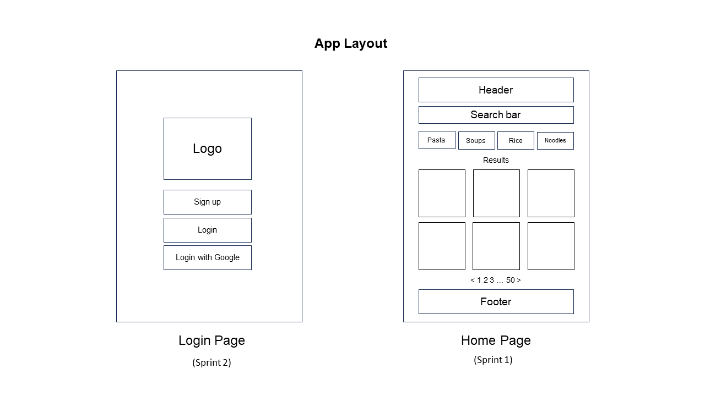

# SavoryScale


A capstone project from [BrainStation's](https://brainstation.io/) Software Engineering September 2023 bootcamp cohort. The backend server can be found [here](https://github.com/ctam62/savoryscale-api).

## APP Preview


## Overview

Meal planning can be a chore when you have a family to plan around, being an athlete, or simply trying to eat healthier. A web application that helps a user find savory recipes and assists with scaling ingredients for meal planning, meal prep and budget considerations. Access recipes, plan meals and create an grocery list on the go. Whether you are in the kitchen, at the grocery store, or at work, build a grocery list based on your tastes. Explore and experiment with different recipes more confidently with quantity adjustments and estimated meal costs.


### Problem

Meal planning can be a challenging task when you have to scale a recipe up or down for the number of people or meals. This can be a daunting task when planning a week’s worth of meals for a family, athlete, or for convenience; especially when having a healthy and balanced lifestyle. The app helps to scale and tally the ingredients to create a comprehensive grocery list and budget for your next trip to the grocery store.


### User Profile

The app is designed for home cooks to simplify the meal planning process. Whether it’s planning for a week’s worth of meals or spicing things up by trying new recipes, the app helps users create a comprehensive grocery list. Users can save their favourite recipes or search for new savouring and adventurous recipes to try.


### Features

This app currently includes the following list of features:

- **Search:** Users can search up a recipe within the app by entering key ingredients.

-	**Recipe scaling:** Automate adjusting ingredient quantities for different serving sizes.

- **Recipe budgeting:** Providing an estimated cost of ingredients to help users budget for their meals more effectively.

- **Smart shopping:** Generate a complete grocery list from a user's scaled recipes to assist them in purchasing the right quantities of ingredients.

<br>

## Implementation

### Tech Stack

- Vite
- Sass
- React.js
- Express.js
  - Knex
  - cors
  - jsonwebtoken
  - bcryptjs
  - bodyparser
  - json-case-convertor
  - pg
- Node.js
- PostgreSQL

### External APIs
- Spoonacular API

### Sitemap
<div style="text-align: centre">
  
</div>

### Mockup Wireframes




### Data


### Endpoints

This app's API server has the following list of endpoints:

**HTTP methods:**

  - GET endpoints
    - Retrieve list of meal type filters
      ```
      /api/mealtypes
      ```
    - Retrieve a single user
      ```
      /api/user/:userId
      ```
    - Retrieve a list of recipes for a single user
      ```
      /api/recipe/user/:userId/recipe
      ```
    - Retrieve a single recipe for a specific user
      ```
      /api/recipe/user/:userId/recipe/:recipeId
      ```
    - Retrieve a user's shopping list
      ```
      /api/shopping/user/:userId
      ```
    - Retrieve a list of saved recipes for a single user
      ```
      /api/recipe/user/:userId/saved_recipe
      ```
    - Retrieve a single saved recipe for a specific user
      ```
      /api/user/:userId/saved_recipe/:savedRecipeId
      ```
    - Retrieve a list of scaled recipes for a single user
      ```
      /api/recipe/user/:userId/scaled_recipe
      ```
    - Retrieve a single scaled recipe for a specific user
      ```
      /api/recipe/user/:userId/scaled_recipe/:scaledRecipeId
      ```
    

- POST endpoints *(sprint 2)*
    - Create a user
      ```
      /api/user
      ```
    - Add recipe to a user
      ```
      /api/recipe/user/:userId/recipe
      ```
    - Create a recipe
      ```
      /api/recipe/user/:userId/recipe
      ```
    - Save a scaled recipe
      ```
      /api/recipe/user/:userId/scaled_recipe
      ```
    - Save a recipe
      ```
      /api/recipe/user/:userId/saved_recipe
      ```
    - Add item to shopping list
      ```
      /api/shopping/user/:userId
      ```
      
- PUT/PATCH, DELETE endpoints *(sprint 2)*
  - Update user info or delete a user
    ```
    /api/user/:userId
    ```
  - Delete a user's recipe
    ```
    /api/recipe/user/:userId/recipe/:recipeId
    ```
  - Update/Delete a user's recipe
    ```
    /api/recipe/user/:userId/recipe/:recipeId
    ```
  - Delete a user's saved recipe
    ```
    /api/recipe/user/:userId/saved_recipe/:savedRecipeId
    ```
  - Delete all saved recipes for a user
    ```
    /api/recipe/user/:userId/saved_recipe
    ```
  - Update/Delete a user's scaled recipe
    ```
    /api/recipe/user/:userId/scaled_recipe/:scaledRecipeId
    ```
  - Delete all scaled recipes for a user
    ```
    /api/recipe/user/:userId/scaled_recipe
    ```
  - Update/Delete a user's shopping list item
    ```
    /api/shopping/user/:userId/item/:itemId
    ```
  - Delete all shopping list items for a user
    ```
    /api/shopping/user/:userId
    ```


- RESPONSES: 
  - 200 success for all GET and PUT/PATCH requests
  - 201 created new content for POST requests
  - 404 not found
  - 401 unauthorized; display if user tries to access user page without logging in
  - 400 bad request
  - 500 internal server error

### Auth

This app will include a user login system in the next sprint update to allow users to better customize their saved favourite recipes and scaling inputs.

<br>

## Roadmap

### Sprint 1
- Home Page, Recipe Page, User/Collections Page, Grocery List Page
- Connect to Spoonacular API
- Create SavoryScale API server and endpoints
  - recipes table 
  - scaled recipes table
  - meal types table
  - users table

### Sprint 2
- User Login authentication and frontend integration
- Save recipes per user
- User recipe customization

### Sprint 3
- Instacart API integration
- Ingredient costs from local grocery stores
- In app ordering

### Sprint 4
- Google Maps / Mapbox API integration to find local grocery stores

<br>

## Nice-to-haves
- User will have the option to sign up with their gmail account
  - OAuth 2.0 implementation
-	Suggest alternative ingredients to help users make budget-friendly choices without compromising nutrition.
- Store price comparisons
- Store price by brand within range
- Provide tailored recommended recipes based on a snapshot of a user's pantry
- Integrate store coupons and deals
- Provide mileage estimates
- Food tips 
- Detailed nutritional information for each scaled recipe, facilitating better dietary planning.
- Recipe Customization
  - Allow users with specific dietary needs or restrictions to customize recipes while maintaining accurate nutritional data.
  - Allow users to add/create their own recipes
- Voice assistance to dictate recipe steps or voice command options

<br>

## Setup
1) Install nodeJS dependencies
    ```
    npm i
    ```
2) Create a .env file with variables from the sample file .env.sample

3) Start the Vite App
    ```
    npm run dev
    ```