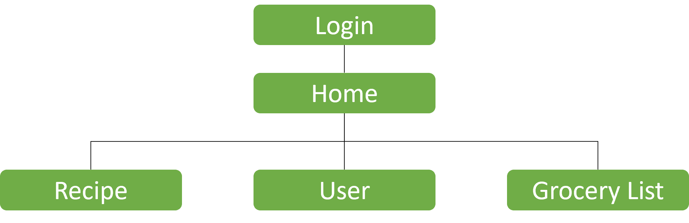
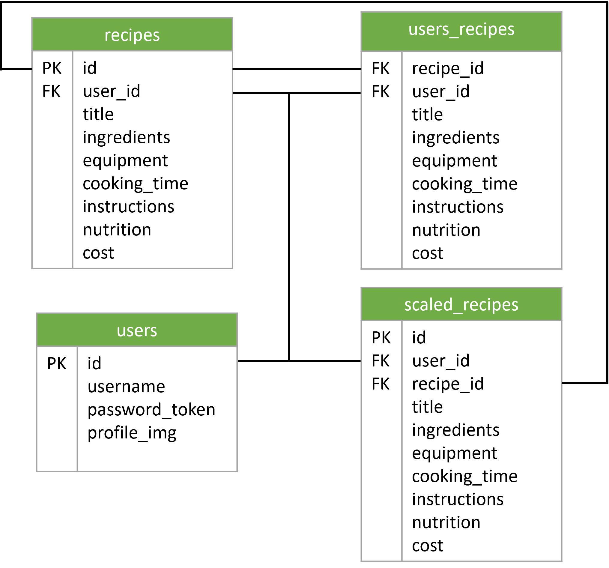

# SavoryScale

## Overview

Meal planning can be a chore when you have a family to plan around, being an athlete, or simply trying to eat healthier. A web application that helps a user find savory recipes and assists with scaling ingredients for meal planning, meal prep and budget considerations. Access recipes, plan meals and create an grocery list on the go. Whether you are in the kitchen, at the grocery store, or at work, build a grocery list based on your tastes. Explore and experiment with different recipes more confidently with quantity adjustments and estimated meal costs.


### Problem

Meal planning can be a challenging task when you have to scale a recipe up or down for the number of people or meals. This can be a daunting task when planning a week’s worth of meals for a family, athlete, or for convenience; especially when having a healthy and balanced lifestyle. The app helps to scale and tally the ingredients to create a comprehensive grocery list and budget for your trip to the grocery store.


### User Profile

The app is designed for home cooks to simplify the meal planning process. Whether it’s planning for a week’s worth of meals or spicing things up by trying new recipes, the app helps users create a comprehensive grocery list. Users can write in and save their favourite recipes or search for new savouring and adventurous recipes to try.


### Features

This app currently includes the following list of features:

- **Search:** Users can search up a recipe within the app by entering key ingredients.

-	**Recipe scaling:** Automate adjusting ingredient quantities for different serving sizes.

- **Recipe budgeting:** Providing an estimated cost of ingredients to help users budget for their meals more effectively.

-	**Cost-effective planning:** Suggest alternative ingredients to help users make budget-friendly choices without compromising nutrition.

- **Smart shopping:** Generate a complete grocery list from a user's scaled recipes to assist them in purchasing the right quantities of ingredients.

<br>

## Implementation

### Tech Stack

- Vite, ReactJS, ExpressJS, NodeJS, mySQL

#### Libraries
- react-google-maps/api

### APIs

- Spoonacular API
- Open Food Facts API
- Presidents Choice API
- Walmart API
- Google Maps API / Mapbox API

### Sitemap
<div style="text-align: centre">
  
</div>

### Mockup Wireframes


### Data Scheme



### Endpoints

This app's API server has the following list of endpoints:

**HTTP methods:**

  - GET endpoints

    - Retrieve a single user
      ```
      /api/users/:id
      ```
    - Retrieve a list of recipes for a single user
      ```
      /api/users/:id/recipes
      ```
    - Retrieve a single recipe from a specific user
      ```
      /api/users/:id/recipes/:id
      ```
    - Retrieve list of recipes
      ```
      /api/recipes
      ```
    - Retrieve a single recipe
      ```
      /api/recipes/:id
      ```
    - Retrieve list of stores
      ```
      /api/stores
      ```
    - Retrieve a single store
      ```
      /api/stores/:id
      ```
    - Retrieve a list of item categories for a specific store i.e., meat, produce
      ```
      /api/stores/:id/:category
      ```
    - Retrieve list of item types by category i.e., chicken, beef
      ```
      /api/stores/:id/:category/:type
      ```
    - Retrieve a single ingredient item
      ```
      /api/stores/:id/:category/:itemtype/:id
      ```

- POST endpoints
    - Create a user
      ```
      /api/users
      ```
    - Add recipe to a user
      ```
      /api/users/:id/recipes
      ```
- PUT/PATCH, DELETE endpoints
  - Update user info or delete a user
    ```
    /api/users/:id
    ```
  - Delete a user's recipe
    ```
    /api/users/:id/recipes/:id
    ```

- RESPONSES: 
  - 200 success for all GET and PUT/PATCH requests
  - 201 created new content for POST requests
  - 404 not found
  - 403 unauthorized; display if user tries to access user page without logging in
  - 400 bad request
  - 500 internal server error

### Auth

This app includes a user login system to allow users to save their favourite recipes and scaling inputs.
  * Users have the option to create an account through the app or use their existing gmail account.
  * OAuth 2.0 will be implemented.

<br>

## Roadmap

Scope your project as a sprint. Break down the tasks that will need to be completed and map out timeframes for implementation. Think about what you can reasonably complete before the due date. The more detail you provide, the easier it will be to build.

### Sprint 1

### Sprint 2

### Sprint 3

<br>

## Nice-to-haves

- Store price comparisons
- Store price by brand within range
- Provide tailored recommended recipes based on a snapshot of a user's pantry
- Integrate store coupons and deals
- Provide mileage estimates
- Food tips 
- Detailed nutritional information for each scaled recipe, facilitating better dietary planning.
- Recipe Customization
  - Allow users with specific dietary needs or restrictions to customize recipes while maintaining accurate nutritional data.
